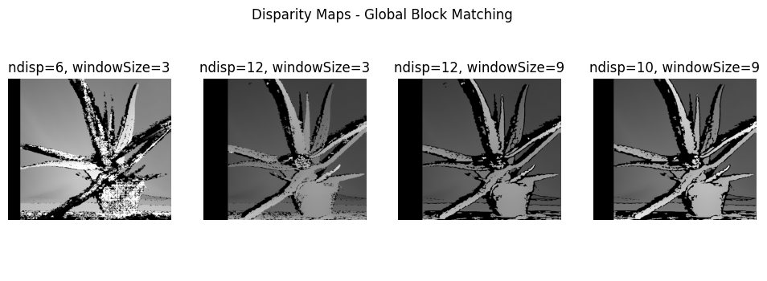
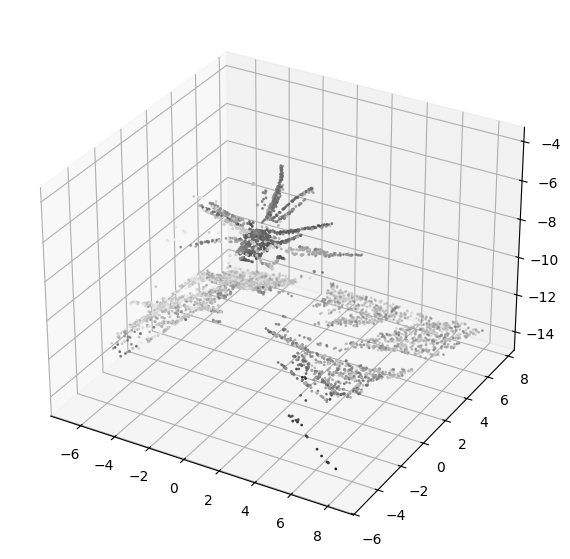

# Depth Estimation Practice

This repository contains a simple practice on depth estimation using stereo images.
The goal is to compute a disparity map from a pair of rectified stereo images and visualize it as a 3D point cloud.

# Requirements

- Python 3.8+
- OpenCV
- NumPy
- Matplotlib

# How it Works

1. Load a pair of rectified stereo images (left & right).

2. Compute disparity map using OpenCV stereo matching algorithms.

3. Reproject the disparity to 3D space with cv2.reprojectImageTo3D.

4. Visualize the 3D point cloud inside Jupyter Notebook or export it to .ply for tools like MeshLab.

## 📊 Example Results

### Disparity Map

### 3D Point Cloud

